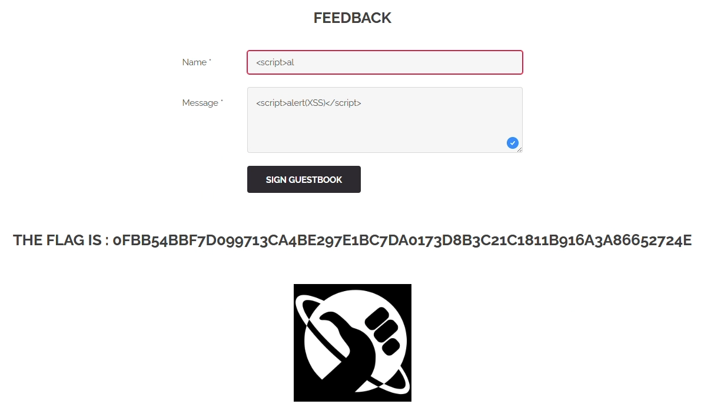

FLAG 3 (xss_stored_feedback)
---

# 1. Explication

## **1.1. Ce qui se passe**

Le site permet de laisser un commentaire ou un message qui sera enregistré et affiché plus tard aux autres visiteurs.

## **1.2. La faille**

Au lieu d'écrire un message texte, j’ai écrit un script. 

Le site l'a pris, l'a enregistré dans sa base de données comme si c'était un message normal.

## **1.3. L'impact**

L'attaque est dite **persistante**. Chaque fois qu'un administrateur ou un utilisateur consulte le Livre d'Or, le script s'exécute automatiquement sur son navigateur. 

Dans notre cas de juste afficher le FLAG.

# 2. Demonstration

Dans le formulaire je rentre le code suivant dans les deux champs :

```bash
<script>alert(XSS)</script>
```

Le site affiche instantanément le FLAG



<aside>
✅

FLAG 3 TROUVÉ : 0fbb54bbf7d099713ca4be297e1bc7da0173d8b3c21c1811b916a3a86652724e

</aside>

# 3. Remediation

Au moment d'afficher le message sur la page, le site doit transformer les caractères spéciaux en **entités HTML**.

- `<` devient `&lt;`
- `>` devient `&gt;`
- `"` devient `&quot;`

Comme ça le navigateur affiche `<script>` comme du texte à lire, et non comme une balise à exécuter.
